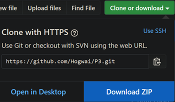

# Mécanisme de recherche d’une combinaison à X chiffres

[](https://app.codacy.com/manual/Hogwai/P3?utm_source=github.com&utm_medium=referral&utm_content=Hogwai/P3&utm_campaign=Badge_Grade_Settings)

Projet #3 du parcours "Développeur d'Application - Java"


Rappel des spécifications:

 - Challenger : L'utilisateur tente de deviner une combinaison définie par le système.
 - Défenseur : L'utilisateur définit une combinaison que le système tente de deviner.
 - Duel : L'utilisateur et le système jouent tour à tour afin de deviner une combinaison définie aléatoirement 

### Livrables
Code source: 
```
p3/src/main/java/com/hogwai/p3
``` 
Fichier de configuration: 
```
p3/src/main/resources/config.properties
``` 
Fichier README: 
```
p3/README.md
``` 
## Prise en main

Ces instructions vont vous permettre de télécharger une copie des fichiers sources et les exécuter sur votre machine locale.

### Prérequis

[Java Development Kit](https://www.oracle.com/technetwork/java/javase/downloads/index.html) - JDK 12.0.1 ou plus

### Installation

Afin d'importer l'ensemble des fichiers sources depuis le répertoire Github, vous pouvez:

- Télécharger directement les fichiers sources depuis le répertoire




- Ou ouvrir un terminal de commande et clonez le répertoire en local

```
git clone https://github.com/Hogwai/P3.git
```

## Lancement de l'application

Une fois les sources rapatriées, rendez-vous dans le dossier exe:
```
cd p3/exe
```
### Sur Windows
Pour démarrer le mécanisme avec le mode développeur désactivé, lancez le fichier:
```
START_P3.bat
```
Et pour activer le mode développeur, lancez ce fichier:
```
START_P3_DEVMODE.bat
```
### Sur Mac OS/Linux
Pour démarrer le mécanisme avec le mode développeur désactivé, lancez le fichier:
```
START_P3.sh
```

Et pour activer le mode développeur, lancez ce fichier:
```
START_P3_DEVMODE.sh
```

### En ligne de commande
Vous pouvez aussi ouvrir un terminal et lancer la commande:
```
java -Dfile.encoding=UTF-8 -jar p3-1.0-SNAPSHOT.jar 
```

Le mode développeur étant désactivé par défaut, vous pouvez l'activer en ajoutant un booléen comme paramètre:
```
java -Dfile.encoding=UTF-8 -jar p3-1.0-SNAPSHOT.jar "true"
```

Cette commande permet de lancer le mécanisme sur les environnements UNIX et Windows confondus.

## Spécificités
### Journalisation
La journalisation de l'application est consultable en se rendant dans le répertoire:
```
p3/exe/logs
```
Et en ouvrant le fichier:
```
App.log
```

### JavaDoc
La JavaDoc est accessible via le lien suivant: [Documentation](https://hogwai.github.io/P3/javadoc/)

## Réalisé avec

* [Log4j2](https://logging.apache.org/log4j/2.x/) - API de journalisation
* [Maven](https://maven.apache.org/) - Gestion des dépendances
* [IntelliJ IDEA 2019](https://www.jetbrains.com/idea/) - Environnement de développement intégré

## Auteur

* **Lilian Wernert** - Hogwai

## Licence

Voir [LICENSE.md](LICENSE.md) pour plus de détails.
